# 💰 Income Prediction System - Advanced ML Dashboard


**Live Demo:** [Streamlit App](https://income-prediction-appproject.streamlit.app/)  
**API Endpoint:** `http://127.0.0.1:8000` (Local Development)  
**GitHub Repository:**  https://github.com/Sahil31312/income-prediction-app_project/tree/main

## 📌 Executive Summary

The **Income Prediction System** is an advanced machine learning application that classifies individuals into income brackets (>$50K or ≤$50K annually) based on demographic and employment features. Built with state-of-the-art ML algorithms and a modern web interface, this system provides real-time predictions with comprehensive analytics and insights.

### 🎯 **Key Differentiators**
- **Dual Prediction Mode**: Local ML model + REST API backend
- **Advanced Feature Engineering**: 12 original + 6 engineered features
- **Real-time Analytics**: Interactive dashboards and visualizations
- **Production-ready**: Error handling, logging, and session management
- **Academic Focus**: Designed as an educational tool for ML concepts

## 📊 Project Overview

### **Business Problem**
Predicting income levels is crucial for:
- Financial institutions (credit scoring, loan approval)
- Government agencies (tax planning, social programs)
- HR departments (salary benchmarking)
- Market researchers (consumer segmentation)

### **Technical Solution**
A machine learning system that:
1. **Trains** on the UCI Adult Dataset (48,842 records)
2. **Processes** 18 features through feature engineering
3. **Predicts** income class with 86%+ accuracy
4. **Visualizes** results through an interactive dashboard

## 🏗️ Architecture & Technology Stack

### **System Architecture**

```mermaid
flowchart TB
    subgraph FE[Frontend Layer]
        S[Streamlit Web Interface<br/>• Real-time predictions<br/>• Interactive visualizations<br/>• User input forms]
    end

    subgraph BE[Backend Layer]
        F[FastAPI REST API<br/>• Model serving endpoint<br/>• Data validation<br/>• Business logic]
    end

    subgraph ML[ML Layer]
        M[Scikit-learn Pipeline<br/>• Random Forest Classifier<br/>• Feature engineering<br/>• Model persistence]
    end

    S --> F
    F --> M
```





### **Installation (3 Methods)**
#### Method 1: Standard Installation (Recommended)

### **Technology Stack**
| Layer | Technology | Purpose |
|-------|------------|---------|
| **Frontend** | Streamlit 1.29.0 | Interactive web interface |
| **Backend API** | FastAPI 0.104.1 | REST API for predictions |
| **ML Framework** | Scikit-learn 1.4.0 | Model training/prediction |
| **Data Processing** | Pandas 2.2.1, NumPy 1.26.4 | Data manipulation |
| **Visualization** | Plotly 5.18.0 | Interactive charts |
| **Model Persistence** | Joblib 1.3.2 | Model serialization |
| **Validation** | Pydantic 1.10.13 | Data validation |
| **ASGI Server** | Uvicorn 0.24.0 | API server |

## 🚀 Quick Start Guide

### **Prerequisites**
```bash
# System Requirements
• Python 3.11 or higher
• 4GB RAM minimum
• 500MB free disk space
• Modern web browser

# Software Requirements
• Git
• pip (Python package manager)
• Virtual environment (recommended)
```

## Method 2: Docker Installation
```
# Build and run with Docker

docker build -t income-predictor .
docker run -p 8501:8501 income-predictor


# Or using Docker Compose
docker-compose up
```

## Method 3: Cloud Deployment (Streamlit Cloud)

1. Push code to GitHub repository
2. Visit share.streamlit.io
3. Connect repository
4. Set main file to streamlit_app.py
5. Deploy!
   

## Verification
```
# Test installation
python -c "import streamlit; print(f'✅ Streamlit {streamlit.__version__}')"
python -c "import pandas; print(f'✅ Pandas {pandas.__version__}')"

# Test model loading
python -c "import joblib; model = joblib.load('deployment_model.joblib'); print('✅ Model loaded successfully')"

# Run test server
streamlit run streamlit_app.py --server.headless true
```


## 📖 User Guide 
###Application Interface
1. 🎯 Prediction Page

```mermaid
flowchart TB
    A[INCOME PREDICTION SYSTEM]

    subgraph D[👤 Demographic Profile]
        D1[Age]
        D2[Gender]
        D3[Race]
        D4[Marital Status]
        D5[Relationship]
        D6[Education]
        D7[Education Years]
    end

    subgraph E[💼 Employment & Financial]
        E1[Work Class]
        E2[Occupation]
        E3[Hours / Week]
        E4[Capital Gain]
        E5[Capital Loss]
        E6[Country]
    end

    B[🚀 GENERATE PREDICTION]

    A --> D
    A --> E
    D --> B
    E --> B

```


## Step-by-Step Usage:

1.Navigate to Prediction Page: Click "🎯 Prediction" in sidebar
2. Fill Demographic Information:

        Set age using slider (18-90 years)

        Select gender, race, marital status

        Choose education level and years

3. Fill Employment Information:

        Select work class and occupation

        Set weekly working hours (20-80)

        Enter capital gain/loss amounts

        Select native country
4. Generate Prediction: Click "🚀 Generate Prediction" button
5. Interpret Results:

        Green Box: High income prediction (>$50K)

        Red Box: Moderate income prediction (≤$50K)

        Gauge Chart: Probability visualization

        Key Factors: Influencing features highlighted

## 📊 Analytics Page

```mermaid
flowchart TB
    A[MODEL ANALYTICS DASHBOARD]

    subgraph PM[📈 Performance Metrics]
        PM1[Accuracy<br/>0.861]
        PM2[F1 Score<br/>0.899]
        PM3[AUC<br/>0.915]
        PM4[Precision<br/>0.856]
    end

    subgraph FI[📊 Feature Importance]
        F1[Education-num — 0.245]
        F2[Age — 0.187]
        F3[Hours-per-week — 0.156]
        F4[Capital-gain — 0.142]
    end

    subgraph MI[🧠 Model Information]
        M1[Type: Random Forest]
        M2[Version: 1.0]
        M3[Training Date: 2024-01-01]
    end

    A --> PM
    A --> FI
    A --> MI

```


## Features:

    Performance Metrics: Accuracy, F1-score, ROC-AUC, Precision

    Visual Charts: Interactive bar charts and plots

    Model Details: Technical specifications and training info

    Feature Analysis: Importance ranking and impact visualization


## 3. 🔍 Insights Page


## Educational Insights:

    Pattern Recognition: Identify common high-income profiles

    Statistical Trends: Age, education, occupation correlations

    Data Sources: UCI Adult Dataset information

    Research Applications: Academic analysis and studies

## 4. 📈 History Page

## History Management:

    Session Tracking: All predictions stored in browser session

    Data Export: Download history as CSV for analysis

    Statistics: Real-time calculation of prediction patterns

    Privacy: Local storage only (no server persistence)

## Input Features Reference
### Demographic Features
| Feature          | Type        | Values / Range   | Description                    |
|------------------|-------------|------------------|--------------------------------|
| Age              | Numerical   | 18–90 years      | Individual's age               |
| Gender           | Categorical | Male, Female     | Biological sex                 |
| Race             | Categorical | 5 categories     | Ethnic background              |
| Marital Status   | Categorical | 7 categories     | Current marital status         |
| Relationship     | Categorical | 6 categories     | Family relationship            |
| Education        | Categorical | 16 levels        | Highest education attained     |
| Education-num    | Numerical   | 1–16 years       | Years of education             |


## Employment & Financial Features
| Feature         | Type        | Values / Range    | Description            |
|-----------------|-------------|-------------------|------------------------|
| Work Class      | Categorical | 8 categories      | Employment type        |
| Occupation      | Categorical | 14 categories     | Job category           |
| Hours per Week  | Numerical   | 20–80 hours       | Weekly working hours   |
| Capital Gain    | Numerical   | $0–100,000        | Investment profits     |
| Capital Loss    | Numerical   | $0–5,000          | Investment losses      |
| Native Country  | Categorical | 13 countries      | Country of origin      |


## Engineered Features (Automatically Generated)


| Feature             | Description                                         | Impact |
|---------------------|-----------------------------------------------------|--------|
| Age Group           | Categorized into 6 groups                           | High   |
| Hours Category      | Part-time / Full-time / Overtime                   | Medium |
| Education Level     | Elementary / Middle / High / College / University / Graduate / PhD | High   |
| Capital Change      | Net capital (gain - loss)                           | Medium |
| Is US               | Binary indicator for United States                  | Low    |
| Has Capital Activity| Any capital gain/loss                               | Medium |


## Output Interpretation
### Prediction Results

## Result Components:

    Income Class: >50K (High) or ≤50K (Moderate)

    Probability: 0-100% confidence score

    Confidence Level: High/Medium/Low based on probability

    Key Factors: Top 3 influencing features

    Gauge Visualization: Color-coded probability meter

## Confidence Interpretation
| Probability Range     | Confidence Level | Interpretation           |
|----------------------|-----------------|--------------------------|
| 0–20% or 80–100%     | HIGH            | Strong model confidence  |
| 20–40% or 60–80%     | MEDIUM          | Moderate confidence      |
| 40–60%               | LOW             | Borderline case          |

## 📊 Model Performance & Evaluation
### Performance Metrics

| Metric     | Value  | Interpretation                        |
|------------|--------|---------------------------------------|
| Accuracy   | 86.1%  | Overall prediction correctness         |
| Precision  | 85.6%  | Correct high-income predictions        |
| Recall     | 83.2%  | Captured high-income individuals      |
| F1-Score   | 89.9%  | Balance of precision and recall       |
| ROC-AUC    | 91.5%  | Model discrimination ability           |


## Confusion Matrix Analysis

**Actual vs Predicted (>50K / ≤50K)**

| Actual \ Predicted | >50K (Predicted) | ≤50K (Predicted) |
|-------------------|-----------------|-----------------|
| >50K (Actual)     | TP: 3,248       | FN: 656         |
| ≤50K (Actual)     | FP: 544         | TN: 9,734       |

**Where:**  
- TP = True Positives (Correct >50K predictions)  
- FN = False Negatives (Missed >50K cases)  
- FP = False Positives (Wrong >50K predictions)  
- TN = True Negatives (Correct ≤50K predictions)  


Feature Importance Analysis

| Rank | Feature          | Importance | Business Insight                     |
|------|-----------------|------------|-------------------------------------|
| 1    | education_num    | 0.245      | Education years most predictive     |
| 2    | age              | 0.187      | Age correlates with income          |
| 3    | hours_per_week   | 0.156      | Work hours significant              |
| 4    | capital_gain     | 0.142      | Investment income indicator         |
| 5    | occupation       | 0.098      | Job type matters                     |
| 6    | marital_status   | 0.072      | Marital status influence             |
| 7    | relationship     | 0.043      | Family role impact                   |
| 8    | workclass        | 0.028      | Employment type                      |
| 9    | sex              | 0.016      | Gender influence                     |
| 10   | race             | 0.013      | Ethnic background                    |


## 🚀 Deployment Guide
### Local Deployment
```
# Production mode
streamlit run streamlit_app.py --server.port=8501 --server.headless=true

# With API backend
uvicorn app.api:app --host 0.0.0.0 --port 8000 &
streamlit run streamlit_app.py --server.port=8501
```

## Streamlit Cloud Deployment

  ### Prepare repository:
  ```  git add .
git commit -m "Deploy to Streamlit Cloud"
git push origin main

```

#### Configure Streamlit Cloud:

    Main file path: streamlit_app.py

    Python version: 3.11

    Secrets: Add via .streamlit/secrets.toml

#### Access deployment:

    URL: https://final.py.streamlit.app

    Monitor logs in Streamlit Cloud dashboard
## Docker Deployment
```
# Dockerfile
FROM python:3.11-slim
WORKDIR /app
COPY requirements.txt .
RUN pip install --no-cache-dir -r requirements.txt
COPY . .
EXPOSE 8501
CMD ["streamlit", "run", "streamlit_app.py", "--server.port=8501", "--server.address=0.0.0.0"]
```
```
# Build and run
docker build -t income-predictor .
docker run -p 8501:8501 income-predictor

# With Docker Compose
version: '3.8'
services:
  web:
    build: .
    ports:
      - "8501:8501"
    environment:
      - PYTHONUNBUFFERED=1
```
## Validation Rules
| Input Field      | Validation Rule      | Error Message                     |
|-----------------|--------------------|----------------------------------|
| Age              | 18 ≤ age ≤ 90       | "Age must be between 18-90"      |
| Hours/Week       | 20 ≤ hours ≤ 80     | "Hours must be 20-80 weekly"     |
| Capital Gain     | 0 ≤ gain ≤ 100000   | "Capital gain must be $0-100,000"|
| Capital Loss     | 0 ≤ loss ≤ 5000     | "Capital loss must be $0-5,000"  |
| Education Years  | 1 ≤ years ≤ 16      | "Education years must be 1-16"   |


## 📈 Usage Examples & Case Studies
### Example 1: Financial Institution

#### Use Case: Credit scoring for loan applicants
##### Input Profile:

    Age: 35, Education: Master's (14 years)

    Occupation: Software Engineer

    Capital Gain: $5,000, Work Hours: 45/week

### Prediction: >$50K (Probability: 82.3%)
### Decision: Approve loan application with favorable terms
### Example 2: HR Department

#### Use Case: Salary benchmarking for new hires
##### Input Profile:

    Age: 28, Education: Bachelor's (12 years)

    Occupation: Marketing Specialist

    Work Hours: 40/week, No capital activity

### Prediction: ≤$50K (Probability: 67.8%)
#### Decision: Set starting salary at $45,000
##### Example 3: Government Agency

### Use Case: Social program eligibility
#### Input Profile:

    Age: 55, Education: High School (9 years)

    Occupation: Retail Sales

    Capital Loss: $2,000, Work Hours: 32/week

#### Prediction: ≤$50K (Probability: 89.2%)
#### Decision: Qualify for assistance programs

## 🔒 Security & Privacy Considerations
### Data Protection
    No PII Storage: Only demographic aggregates stored

    Session-based: Predictions stored in browser session only

    No External Sharing: Data never leaves local instance

    Encryption: HTTPS for all cloud deployments


## 📄 License & Attribution
### License

#### This project is licensed under the MIT License - see LICENSE file for details.
### Attribution

    Dataset: UCI Machine Learning Repository - Adult Dataset

    Libraries: Scikit-learn, Pandas, NumPy, Streamlit, FastAPI

    Icons: Font Awesome, Material Icons

    Inspiration: Various academic papers on income prediction

## Academic Citation
## Citation

If you use this project in your research, please cite it as:

```bibtex
@software{income_prediction_2024,
  author = {Khairullah Ibrahim Khail},
  title = {Income Prediction System - Advanced ML Dashboard},
  year = {2024},
  publisher = {GitHub},
  url = {https://github.com/yourusername/income-prediction-system}
}

```

## 👥 Team & Acknowledgments
### Development Team

| Role             | Name                        | Contribution                             |
|-----------------|-----------------------------|-----------------------------------------|
| Project Lead     | Khairullah Ibrahim Khail     | Full-stack developer & Machine Learning Engineer |
| Academic Advisor | Dr. Muhammad Sajjad          | Research guidance                        |
| ML Consultant    |  Khairullah Ibrahim Khail                 | Model optimization                        |
| UI/UX Design     | Khairullah Ibrahim Khail     | Interface design                          |


## Acknowledgments

    University: Department of Computer Science

    Course: Advanced Machine Learning

    Professor: Dr. Muhammad Sajjad

    Peers: Classmates for feedback and testing
    📧 Email: ibrahimkhil975@gmail.com

## ⭐ If you like this project, give it a star!
### It helps me know this project is useful and keeps it active.  
[Click here to star the repo](https://github.com/Sahil31312/income-prediction-app_project/stargazers)

 
 
## Empowering Data-Driven Income Decisions
```
*Last Updated: December 2024 | Version: 2.1.0 | Model: RF-2025-12-v1*
 
```


